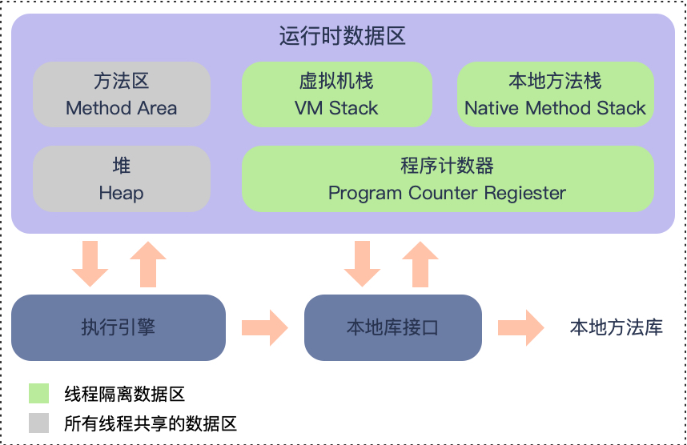

## JVM虚拟机内存模型与内存溢出异常


### 程序计数器
程序计数器是计算机处理器中的寄存器，它包含当前正在执行的指令的地址。当执行一条指令时，首先需要根据PC中存放的指令地址，将指令由内存取到指令寄存器中，此过程称为“取指令”。与此同时，PC中的地址或自动加1或由转移指针给出下一条指令的地址。此后经过分析指令，执行指令。完成第一条指令的执行，而后根据PC取出第二条指令的地址，如此循环，执行每一条指令。

程序计数器可以认为当前线程的字节码执行器。字节码执行器的工作原理就是通过改变计数器的值来取下一条需要执行的字节码指令，分支，循环，跳转，异常处理，线程恢复都需要计数器来完成。java中的多线程是通过轮流切换分配处理器来执行的，在任何时间，一个处理器只处理一条指令，所以一旦切换线程，就依靠程序计数器来确定执行到了哪一行代码，或者说是哪一行指令，所以，程序计数器是私有的，才能保证各个线程间的任务执行互不影响.

如果线程运行的是一个java的方法，程序计数器记录的是虚拟机字节码指令的地址（在jvm启动后，编译java文件成字节码文件），而如果是一个Native方法，程序计数器则为空，这里也是java虚拟机规范中，唯一一个没有规定OutOfMemoryError的区域。

### JAVA虚拟机栈
JAVA虚拟机栈与程序计数器一样都是线程隔离的，生命周期与线程相同。
虚拟机栈描述的是java方法执行的内存模型：每个方法执行的同时会创建一个栈帧（Stack Frame）用与存储局部变量表，操作数栈，动态链表，方法的出口等信息。每一个java方法的执行都对应一个栈帧在虚拟机中入栈到出栈的过程。

* 局部变量表
  1. 存放的是编译时期的各种基本数据类型（byte、boolean、char、short、int、float、long、double）以及对象的引用（包括指向对象地址的引用指针或者是代表对象的句柄或者是相应的位置）和returnAddress类型（指向一条字节码指令的地址：函数返回地址）
  2. 局部变量表所需的内存空间在编译期间完成分配
* 操作数栈
  1. 操作数栈　遵循FIFO的原则。在操作数栈刚建立的时候为空的，只有在执行方法的时候才用于存放从局部变量表或者是全局常量等地方复制过来的数据，及生成的结果。操作数栈在存放的时候。long、double占用2个变量空间（Slot），其他占用一个。
  2. 由于局部变量表的内存空间在编译期间已完成，所以在进入一个方法的时候，在操作数栈所要分配的内存空间已经完全确定，且在方法运行期间不会再发生变化
* 动态链接方法出口
  1. 每一个栈中都包含一个指向运行时常量池中的引用。常量池中存在大量的符号参数，字节码的调用就以调用常量池中指向方法的符号 引用为参数，比如在类加载或者是第一次使用的时候转化为直接引用，（final、static），还有就是在运行期间转化
  2. 当一个方法通过执行后，可能会有2种情况推出，执行引擎遇到返回指令或者是遇到异常，并且异常未在方法内处理。不管哪种情况，一旦方法返回，肯定要获得返回的地址，来保证正常的执行。而且在返回时可能会保存一些信息，来完成上层的处理。正常推出时，会将程序计数器来作为返回的地址；出现异常时则会通过异常处理器来确定
   
* 出现的异常类型
  1. 当线程请求的栈深度大于虚拟机所允许的时候，会抛出StackOverFlowError异常
    ```java
    public class Demo {
    public static void main(String[] args) {
        test();
    }

    public static void test() {
        System.out.print("1234");
        test();
    }
}
    ```   
  2. 当虚拟机栈动态扩容的时候，如果无法申请到足够的内存（申请的内存可能已经超过实际的内存），会抛出OutOfMemoryError异常
### 本地方法栈
本地方法栈与虚拟机栈作用类似，区别在于虚拟机栈为虚拟机执行java方法服务的，而本地方法栈则是为虚拟机用到的native方法服务的。本地方法栈也出现StackOverFlowError和OutOfMemoryError异常
### JAVA堆
java堆（java Heap）是java虚拟机所管理内存最大的一部分，java堆是被所有线程共享的一块内存区域，在虚拟机启动时创建堆。
java堆是垃圾回收的主要区域，从内存回收的角度来看，java对可以分为新生代和老年代，在细致点有Eden空间，From Survivor空间，To Survivor空间。。java对中的物理空间可以不连续，只要保证逻辑上是连续的即可，可以通过-Xms和-Xmx控制虚拟机创建的内存的大小。
### 方法区
方法区和java堆一样都是线程共享区域，用于存储已被虚拟机加载的类信息，常量， 静态变量，即时编译器编译后的代码数据。虽然java虚拟规范是将方法区描述为堆的一个逻辑部分，但它确有一个别名交Not-heap(非堆)，目的是与Java堆区别开来。
